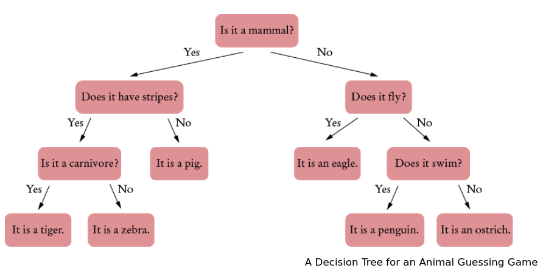

# CIS202 Decision Tree Project

      The figure below shows a decision tree for guessing an animal 
      from one of several choices. Each non-leaf node contains a question. 
      The left subtree corresponds to a “yes” answer, and the right subtree 
      to a “no” answer.  

      This is a binary tree because every node has either two children 
      (if it is a decision) or no children (if it is a conclusion). 

      Implement an animal guessing game with the decision tree described 
      above. Start with the tree in the figure, but present the leaves as 
      “Is it a(n) X?” If it wasn’t, ask the user what the animal was, and 
      ask for a question that is true for that animal but false for X. Then 
      insert a new node for that animal. For example,

      Is it a mammal? Y  
      Does it have stripes? N  
      Is it a pig? N  
      I give up. What is it? A hamster  

      Please give me a question that is true for a hamster and false for a pig.
      Is it small and cuddly?  

      Now insert a node so that this question is used in future dialogs:  

      Is it a mammal? Y  
      Does it have stripes? N  
      Is it small and cuddly?  

      In this way, the program learns additional facts.

  
      Additionally, write the tree to a file when the program exits. 
      Load the file when the program starts again.
